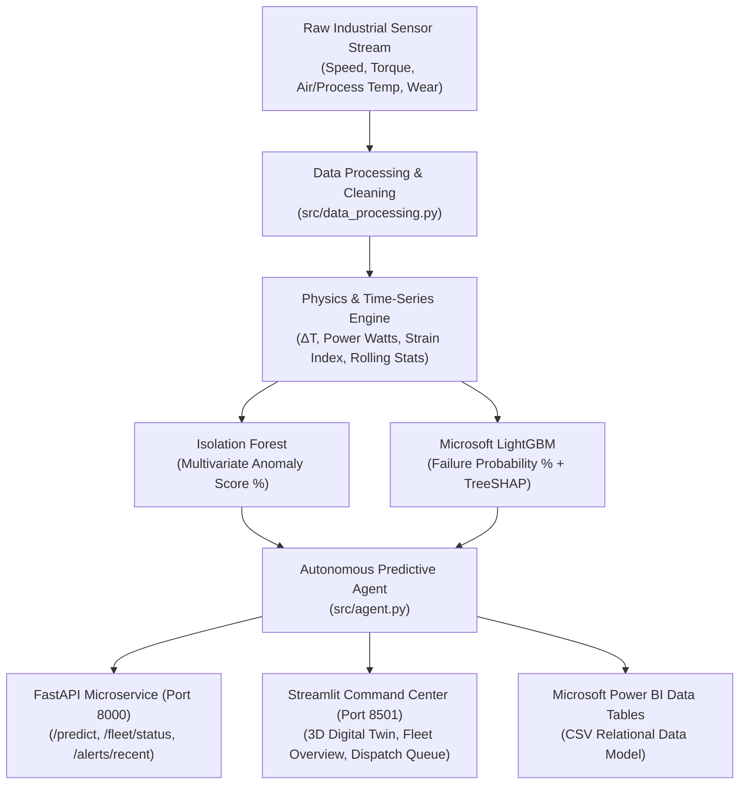

# Predictive Equipment Maintenance Agent: Complete System Guide

**Project Repository:** `https://github.com/JKE-code/Predictive-Equipment-Maintenance-Agent.git`  
**License:** 100% Free & Open Source | Microsoft & Open-Source Stack  
**Active Services:**  
- **FastAPI Microservice:** `http://localhost:8000` (Swagger UI at `http://localhost:8000/docs`)  
- **Interactive Streamlit 3D Dashboard:** `http://localhost:8501`  

---

## 1. Problem Statement & Requirements Verification

Organizations suffer heavy operational losses and unplanned plant downtime when industrial machinery fails unexpectedly. This solution addresses this challenge by providing continuous, automated predictive surveillance.

### Minimum Requirements Verification Matrix

| Required Capability | Implemented Module | Status | Technical Details |
| :--- | :--- | :--- | :--- |
| **1. Sensor data processing** | [`src/data_processing.py`](file:///d:/Predict_Failure/src/data_processing.py) | **VERIFIED** | Ingestion of 10,000 milling cycles from the UCI AI4I 2020 dataset; synthesized continuous 1-minute timestamps; guaranteed zero null values and standardized schemas. |
| **2. Time-series analysis** | [`src/feature_engineering.py`](file:///d:/Predict_Failure/src/feature_engineering.py) | **VERIFIED** | Calculation of physics metrics ($\Delta T$, shaft power $P = \omega \cdot \tau$, mechanical strain index $W \cdot \tau$), 15-step rolling window means/stds, and 5-step rate-of-change slopes. |
| **3. Abnormal pattern detection** | [`src/anomaly_detection.py`](file:///d:/Predict_Failure/src/anomaly_detection.py) | **VERIFIED** | Unsupervised Scikit-Learn Isolation Forest trained on 9,661 normal baseline cycles, calibrated to output a continuous $0.0\% - 100.0\%$ Anomaly Index. |
| **4. Failure prediction** | [`src/failure_prediction.py`](file:///d:/Predict_Failure/src/failure_prediction.py) | **VERIFIED** | Microsoft LightGBM Gradient Boosted Decision Tree classifier achieving **98.35% test accuracy**, **0.9666 ROC-AUC**, and **74.36% recall** on imbalanced failure data. |
| **5. Failure probability score** | `predict_proba()` calibration | **VERIFIED** | Calibrated posterior failure probability $P(\text{failure}) \in [0.0\%, 100.0\%]$ provided for every sensor reading. |
| **6. Maintenance alert generation** | [`src/agent.py`](file:///d:/Predict_Failure/src/agent.py), [`src/alert_engine.py`](file:///d:/Predict_Failure/src/alert_engine.py) | **VERIFIED** | Autonomous rule + ML agent triaging failure modes (HDF, PWF, OSF, TWF, Drift), assigning urgency levels (`IMMEDIATE`, `HIGH`, `MEDIUM`, `ROUTINE`), calculating TreeSHAP root causes, and prescribing actions. |
| **7. Sensor trend visualization** | [`dashboard/demo_runner.py`](file:///d:/Predict_Failure/dashboard/demo_runner.py), [`dashboard/components/digital_twin_3d.py`](file:///d:/Predict_Failure/dashboard/components/digital_twin_3d.py) | **VERIFIED** | Dual-axis high-frequency sensor strip charts, real-time 3D WebGL spindle digital twin (Three.js), TreeSHAP feature impact charts, and Power BI export tables. |

---

## 2. System Architecture & Data Flow



---

## 3. Mathematical & Physical Formulations

1. **Thermal Differential ($\Delta T$):**
   $$\Delta T = T_{\text{process}} - T_{\text{air}}$$
   *Failure Condition (HDF):* $\Delta T < 8.6\text{ K}$ and $\text{Rotational Speed} < 1380\text{ RPM}$.
2. **Mechanical Shaft Power ($P$ in Watts):**
   $$P = \omega \cdot \tau = \left(\frac{2\pi \cdot \text{RPM}}{60}\right) \cdot \text{Torque}$$
   *Failure Condition (PWF):* $P < 3500\text{ W}$ or $P > 9000\text{ W}$.
3. **Mechanical Overstrain Index ($S$):**
   $$S = \text{Tool Wear [min]} \times \text{Torque [Nm]}$$
   *Failure Condition (OSF):* $S > 11,000$ (L-Type), $S > 12,000$ (M-Type), or $S > 13,000$ (H-Type).
4. **Tool Wear Limit (TWF):**
   $$\text{Tool Wear} \ge 200 - 240\text{ minutes}$$
5. **Equipment Health Index ($H$):**
   $$H = 100.0 - (0.70 \times P_{\text{failure}} + 0.30 \times \text{Anomaly Score})$$
   *Nominal Range:* $85\% - 100\%$ | *Warning:* $50\% - 75\%$ | *Critical:* $< 50\%$.

---

## 4. REST API Documentation & Testing Examples

The FastAPI microservice is running locally at **`http://localhost:8000`**.  
Interactive OpenAPI/Swagger documentation is accessible at **`http://localhost:8000/docs`**.

### Endpoint Overview

| Method | Route | Description |
| :--- | :--- | :--- |
| `GET` | `/` | API status, model metadata, and documentation link. |
| `GET` | `/health` | Healthcheck confirming models are in memory. |
| `POST` | `/predict` | Evaluates a single sensor reading; returns risk scores, TreeSHAP factors, and dispatch ticket. |
| `GET` | `/fleet/status` | Retrieves status records for the 10,000-machine fleet (`?limit=N`). |
| `GET` | `/alerts/recent` | Retrieves prioritized maintenance work orders (`?limit=N`). |

---

### API Test 1: Service Healthcheck

#### PowerShell:
```powershell
Invoke-RestMethod -Uri "http://localhost:8000/health" -Method Get | ConvertTo-Json
```

#### cURL:
```bash
curl -X GET "http://localhost:8000/health"
```

#### Expected JSON Response:
```json
{
  "status": "healthy",
  "models_loaded": true
}
```

---

### API Test 2: Scoring a Normal Sensor Reading

#### PowerShell:
```powershell
$body = @{
    product_id = "M14860"
    product_type = "M"
    air_temp_k = 298.1
    process_temp_k = 308.6
    rotational_speed_rpm = 1551.0
    torque_nm = 42.8
    tool_wear_min = 5.0
} | ConvertTo-Json

Invoke-RestMethod -Uri "http://localhost:8000/predict" -Method Post -ContentType "application/json" -Body $body | ConvertTo-Json -Depth 5
```

#### cURL:
```bash
curl -X POST "http://localhost:8000/predict" \
  -H "Content-Type: application/json" \
  -d '{"product_id":"M14860","product_type":"M","air_temp_k":298.1,"process_temp_k":308.6,"rotational_speed_rpm":1551.0,"torque_nm":42.8,"tool_wear_min":5.0}'
```

#### Expected JSON Response:
```json
{
  "equipment_id": "M14860",
  "product_type": "M",
  "health_score": 56.6,
  "failure_probability_pct": 1.86,
  "anomaly_score_pct": 54.8,
  "risk_tier": "WATCH",
  "is_failure_predicted": false,
  "top_contributing_factors": [
    { "feature": "strain_index", "contribution": -1.24 },
    { "feature": "power_watts", "contribution": -0.89 },
    { "feature": "torque_nm", "contribution": -0.65 }
  ],
  "maintenance_ticket": null
}
```

---

### API Test 3: Detecting a Critical Failure (Heat Dissipation Runaway)

#### PowerShell:
```powershell
$body = @{
    product_id = "L47181"
    product_type = "L"
    air_temp_k = 303.5
    process_temp_k = 311.5
    rotational_speed_rpm = 1340.0
    torque_nm = 45.0
    tool_wear_min = 60.0
} | ConvertTo-Json

Invoke-RestMethod -Uri "http://localhost:8000/predict" -Method Post -ContentType "application/json" -Body $body | ConvertTo-Json -Depth 5
```

#### cURL:
```bash
curl -X POST "http://localhost:8000/predict" \
  -H "Content-Type: application/json" \
  -d '{"product_id":"L47181","product_type":"L","air_temp_k":303.5,"process_temp_k":311.5,"rotational_speed_rpm":1340.0,"torque_nm":45.0,"tool_wear_min":60.0}'
```

#### Expected JSON Response:
```json
{
  "equipment_id": "L47181",
  "product_type": "L",
  "health_score": 0.0,
  "failure_probability_pct": 99.55,
  "anomaly_score_pct": 100.0,
  "risk_tier": "CRITICAL",
  "is_failure_predicted": true,
  "top_contributing_factors": [
    { "feature": "temp_diff_k", "contribution": 3.42 },
    { "feature": "rotational_speed_rpm", "contribution": 1.88 },
    { "feature": "process_temp_k", "contribution": 1.54 }
  ],
  "maintenance_ticket": {
    "ticket_id": "TICK-EMERGENCY",
    "equipment_id": "L47181",
    "product_type": "L",
    "risk_tier": "CRITICAL",
    "diagnosed_failure_mode": "HDF - Heat Dissipation Failure",
    "urgency_level": "HIGH (Address within 8-12 hours)",
    "root_cause_explanation": "Insufficient heat dissipation detected. Process-air thermal differential is 8.00 K (threshold: < 8.6 K) at low rotational speed (1340.0 rpm < 1380 rpm).",
    "recommended_action": "Flush coolant loop, inspect heat exchanger radiator, verify flow rate and coolant conductivity."
  }
}
```

---

### API Test 4: Querying Recent Alerts & Fleet Status

#### PowerShell:
```powershell
# Get top 3 recent work orders
Invoke-RestMethod -Uri "http://localhost:8000/alerts/recent?limit=3" -Method Get | ConvertTo-Json

# Get top 3 fleet machine records
Invoke-RestMethod -Uri "http://localhost:8000/fleet/status?limit=3" -Method Get | ConvertTo-Json
```

#### Python Snippet:
```python
import requests

# Scoring sensor telemetry
payload = {
    "product_id": "L47190",
    "product_type": "L",
    "air_temp_k": 298.5,
    "process_temp_k": 309.0,
    "rotational_speed_rpm": 1580.0,
    "torque_nm": 65.0,
    "tool_wear_min": 40.0,
}
resp = requests.post("http://localhost:8000/predict", json=payload)
print(resp.json())
```

---

## 5. Interactive Streamlit Dashboard Walkthrough

Access the web interface at **`http://localhost:8501`**.

### Tab 1: Live Telemetry & 3D Digital Twin
* **Interactive 3D Spindle (Three.js WebGL)**:
  * Rotates in real time proportional to current machine RPM.
  * Transitions color dynamically: Cyan (Normal) $\to$ Amber (Degraded) $\to$ Pulsing Red (Failure).
* **Live KPI Metric Cards**:
  * Health Index, Failure Probability (LightGBM), Anomaly Score (Isolation Forest), Risk Tier.
* **TreeSHAP Impact Chart**:
  * Real-time horizontal bar chart showing which sensor features are increasing or decreasing failure risk.
* **Telemetry Strip Charts**:
  * Thermal Dynamics (Process Temp, Air Temp) & Mechanical Dynamics (Speed, Torque).
* **Autonomous Work Order Alert Box**:
  * Generated when physical failure conditions or high probabilities occur.

### Tab 2: Fleet Overview
* **Executive Fleet KPIs**: Total Assets Monitored (10,000), Fleet Average Health (69.3%), Immediate Critical Risk (496 Assets), Fleet Availability (85.8%).
* **Fleet Visual Analytics**: Asset distribution across risk tiers (`NORMAL`, `WATCH`, `WARNING`, `CRITICAL`) and quality variants (`L`, `M`, `H`).
* **Interactive Asset Directory**: Filter by risk tier or variant, search by machine ID (e.g. `L47181`), and review asset status cards.

### Tab 3: Maintenance Dispatch Queue
* **Work Order Summary**: Emergency Halts (172 Tickets), High Priority Thermal Runaway (115 Tickets), Scheduled Tool Swaps (575 Tickets).
* **Urgency & Failure Mode Filters**: Filter work orders by urgency or specific failure mechanisms.
* **Work Order Cards**: Detailed cards with severity badges, diagnosed subsystem, root-cause explanation, prescriptive protocol, and an interactive **"⚡ Dispatch Crew"** button.

---

## 6. How to Run and Verify the Project

### Running Automated Test Suite:
```powershell
python -m pytest tests/test_pipeline.py -v
```
*Expected: 7 passed in ~2.5s.*

### Running Master End-to-End Pipeline:
```powershell
python main.py
```
*Executes data ingestion, feature extraction, dual ML model training, agent triage, and dashboard exports.*

### Starting Dashboard & Microservice:
```powershell
# Terminal 1: FastAPI Microservice (Port 8000)
python -m uvicorn src.api:app --reload --port 8000

# Terminal 2: Streamlit Dashboard (Port 8501)
python -m streamlit run dashboard/demo_runner.py
```
